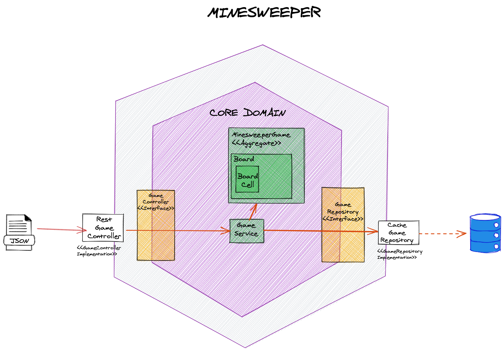

# minesweeper-API
- This is the codebase of minesweeper-api, a RESTful API that will allow you play the popular game Minesweeper

## The Game
Develop the classic game of [Minesweeper](https://en.wikipedia.org/wiki/Minesweeper_(video_game))

## Tech Stack

1. Spring Boot
2. Java 11
3. JUnit 5 (Jupiter)
4. Gradle
5. Lombok

## Architecture
In order to build this service, I applied some concepts from Domain Driven Design, this means following the principles of
Hexagonal Architecture (Ports and Adapters).

### Adapters (API and Infra) Layer
This Layer has the components that are specific for integration of the service, in this case the RestController for exposing the API
and the CacheRespository for interacting with a datasource.

### Domain Layer
This layer comprises the concepts that are meaningful to the Game Logic (Business Domain) for example: The Board, 
the BoardCell, and MinesweeperGame.
Another concept that I tried to model using DDD is the Aggregate, using this concept I determined the scope of the Transaction
which comprises the concept of Game, this concept must cluster other related concepts: Board and its corresponding list of cells.
So fundamentally, this cluster of objects has consistency when they are saved together.

###Ports
This layer represents the different ways of interactions that external services or dependencies can have with minesweeper-api.
Most times this represents the protocol that is going to be used for integrations.

Here is a high-level diagram that depicts this explanation:

The red arrows explain the flow of data:
- minesweeper-api receives requests in JSON format
- RestGameController focuses on handling these requests by calling GameService to execute the corresponding action based on the request.
- GameService uses the Domain Objects: MinesweeperGame, Board, BoardCell to execute the request and then calls the Repository to persist the state of those objects.

 
## Deliverables:
* You can check the game is deployed and running in heroku over here: [minesweeper-api-health](https://mine-sweeper-game.herokuapp.com/actuator/health)
* Link to access Swagger: [minesweeper-api-swagger](https://mine-sweeper-game.herokuapp.com/swagger-ui.html#/)

